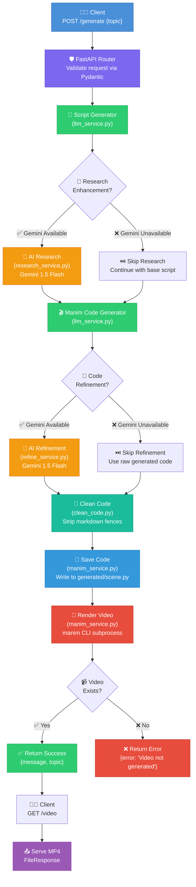
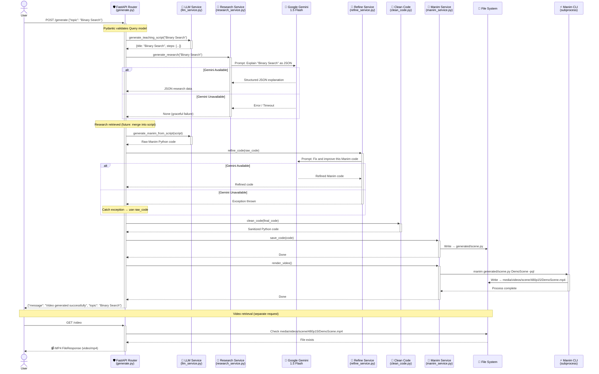
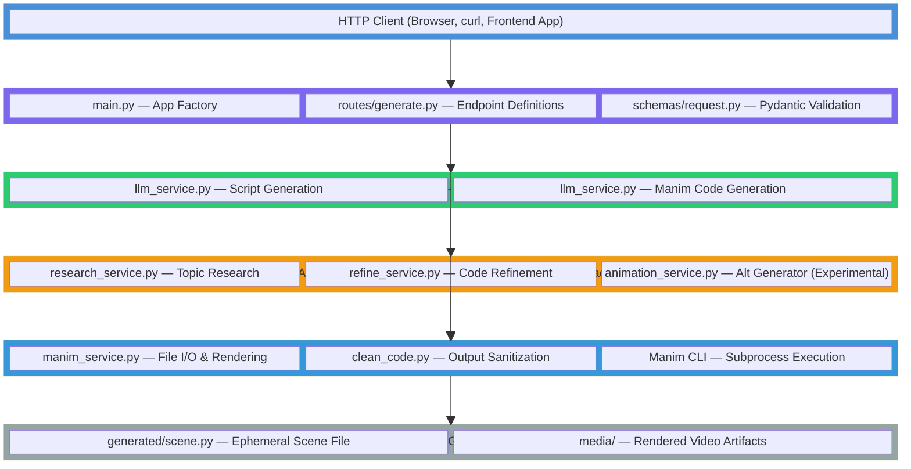
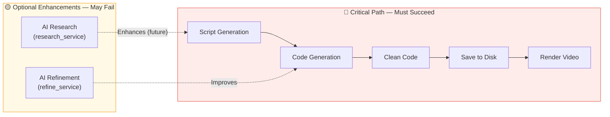

## Code2Concept
# 🏗️ Code2Concept — Architecture Document

> **Code2Concept** is an AI-powered educational video generation platform that transforms any topic into an animated teaching video. It combines deterministic script generation with optional AI enhancement (Google Gemini) and Manim-based mathematical animation rendering — all served through a clean FastAPI backend.

---

## Table of Contents

- [Project Overview](#-project-overview)
- [Tech Stack](#-tech-stack)
- [Directory Structure](#-directory-structure)
- [System Architecture](#-system-architecture)
- [Component Breakdown](#-component-breakdown)
- [Data Flow](#-data-flow)
- [API Reference](#-api-reference)
- [Layered Architecture](#-layered-architecture)
- [Error Handling & Graceful Fallbacks](#-error-handling--graceful-fallbacks)
- [Future Improvements & Roadmap](#-future-improvements--roadmap)

---

## 📖 Project Overview

Code2Concept automates the creation of short educational animation videos. A user submits a topic (e.g., *"Binary Search"*), and the system:

1. **Generates a structured teaching script** with a title and step-by-step explanations
2. **Optionally enriches** the script with AI-powered research via Google Gemini
3. **Produces Manim animation code** that visualizes the teaching content
4. **Optionally refines** the generated code with AI to fix errors and improve quality
5. **Cleans, saves, and renders** the code into an MP4 video using the Manim engine
6. **Serves the video** to the user via a REST API endpoint

The architecture follows a **resilient pipeline pattern** — the core flow always succeeds using deterministic templates, while AI-powered stages enhance quality when available and fail gracefully when they don't.

---

## ⚙️ Tech Stack

| Layer              | Technology                        | Purpose                                      |
| ------------------ | --------------------------------- | -------------------------------------------- |
| **Web Framework**  | FastAPI                           | Async REST API with automatic OpenAPI docs   |
| **ASGI Server**    | Uvicorn                           | High-performance async server                |
| **Animation**      | Manim (Community Edition)         | Programmatic math/educational animations     |
| **AI / LLM**       | Google Gemini 1.5 Flash           | Topic research & code refinement             |
| **Validation**     | Pydantic                          | Request/response data validation             |
| **Configuration**  | python-dotenv                     | Environment variable management              |
| **Language**       | Python 3.10+                      | Primary development language                 |

---

## 📁 Directory Structure

```
ARCHITECTURE.md                     # Detailed architecture document
architecture.tldr                   # Short architecture summary
README.md                           # Project overview and setup docs
backend/
├── app/                            # FastAPI backend source code
│   ├── main.py                     # App entrypoint and router registration
│   ├── routes/
│   │   └── generate.py             # /generate and /video endpoints
│   ├── schemas/
│   │   └── request.py              # Pydantic request schema
│   ├── services/
│   │   ├── llm_service.py          # Deterministic script and Manim code generation
│   │   ├── research_service.py     # Gemini-based topic research
│   │   ├── refine_service.py       # Gemini-based code refinement
│   │   ├── animation_service.py    # Experimental animation generation path
│   │   └── manim_service.py        # Save scene code and render with Manim CLI
│   └── utils/
│       └── clean_code.py           # Removes markdown fences from generated code
├── generated/
│   ├── scene.py                    # Generated Manim scene (overwritten per request)
│   └── media/                      # Intermediate render artifacts from Manim
├── media/
│   ├── images/scene/               # Frame/image artifacts
│   ├── texts/                      # Manim text cache
│   └── videos/scene/480p15/
│       └── partial_movie_files/
│           └── DemoScene/          # Partial clips and ffmpeg list files
├── requirements.txt                # Python dependencies
└── .env                            # Backend environment variables
frontend/
├── index.html                      # Vite HTML entrypoint
├── package.json                    # Frontend scripts and dependencies
├── package-lock.json               # Locked dependency graph
├── vite.config.js                  # Vite configuration
├── eslint.config.js                # ESLint configuration
├── public/                         # Static assets served as-is
└── src/
    ├── main.jsx                    # React bootstrap
    ├── App.jsx                     # Root app component
    ├── api.js                      # API client helper
    ├── App.css                     # App-level styles
    ├── index.css                   # Global styles
    ├── assets/                     # Bundled assets
    └── components/
        ├── Loader.jsx              # Loading indicator component
        ├── VideoPlayer.jsx         # Video playback component
        └── VideoPlayer.css         # Styles for video player
```

### Key Observations

| Directory      | Role                                                                                           |
| -------------- | ---------------------------------------------------------------------------------------------- |
| `backend/app/routes`   | Thin controller layer that orchestrates the generation pipeline and delegates to services |
| `backend/app/services` | Business logic layer for script generation, research, refinement, and rendering            |
| `backend/app/schemas`  | API contracts and input validation via Pydantic                                            |
| `backend/generated`    | Ephemeral generated code and intermediate artifacts                                         |
| `backend/media`        | Render output and caches produced by Manim                                                 |
| `frontend/src`         | React UI source, API integration, and reusable components                                  |

---

## 🧩 System Architecture

The system follows a **linear pipeline architecture** where a user request flows through a series of processing stages. Each stage transforms or enriches the data before passing it to the next.

### Request Lifecycle Flowchart



---

## 🔍 Component Breakdown

### 1. `main.py` — Application Entry Point

```python
app = FastAPI()
app.include_router(router)
```

- Creates the FastAPI application instance
- Registers the single router from `routes/generate.py`
- Serves as the ASGI entry point for Uvicorn (`uvicorn app.main:app`)

### 2. `routes/generate.py` — Pipeline Orchestrator

The **central nervous system** of the application. This module defines two endpoints and orchestrates the entire video generation pipeline:

| Endpoint         | Method | Description                                         |
| ---------------- | ------ | --------------------------------------------------- |
| `/generate`      | POST   | Accepts a topic, runs the full pipeline             |
| `/video`         | GET    | Serves the most recently rendered MP4 video         |

The `/generate` handler executes all pipeline stages sequentially, wrapping optional AI stages in try/except blocks for graceful degradation.

### 3. `schemas/request.py` — Request Validation

```python
class Query(BaseModel):
    topic: str
```

- Defines the **data contract** for the `/generate` endpoint
- Leverages Pydantic for automatic validation, serialization, and OpenAPI schema generation
- Rejects requests missing the `topic` field with a 422 Unprocessable Entity response

### 4. `services/llm_service.py` — Script & Code Generator (Core)

**This is the deterministic backbone of the system.** It contains two functions:

| Function                         | Input         | Output                                 |
| -------------------------------- | ------------- | -------------------------------------- |
| `generate_teaching_script(topic)` | Topic string  | Dict with `title` and `steps` list     |
| `generate_manim_from_script(script)` | Script dict | Raw Manim Python code string            |

**Script Generation Strategy:**
- Maintains a lookup of hardcoded, curated scripts for known topics (`binary search`, `AI`)
- Falls back to a generic template for unknown topics
- **Zero external dependencies** — this function never fails

**Code Generation Strategy:**
- Builds a Manim `DemoScene` class programmatically
- Iterates over script steps, creating `Text` objects with staggered vertical positioning
- Produces syntactically valid Manim code that can render independently of AI services

### 5. `services/research_service.py` — AI Research (Optional Enhancement)

| Function                   | Input        | Output                          |
| -------------------------- | ------------ | ------------------------------- |
| `generate_research(topic)` | Topic string | Structured JSON string or `None` |

- Calls **Google Gemini 1.5 Flash** with a structured prompt requesting JSON output
- Retrieves detailed concept explanations, steps, and examples
- Loads API key from `GEMINI_API_KEY` environment variable via `python-dotenv`
- **Returns `None` on any failure** — designed to be non-blocking
- Currently, research output is retrieved but not yet merged into the script (future enhancement)

### 6. `services/refine_service.py` — AI Code Refinement (Optional Enhancement)

| Function           | Input             | Output                       |
| ------------------ | ----------------- | ---------------------------- |
| `refine_code(code)` | Raw Manim code   | Improved Manim code string    |

- Sends the generated Manim code to **Gemini 1.5 Flash** for review and improvement
- Prompt instructs the AI to fix syntax errors, improve animations, and ensure clean structure
- On failure, the calling code **falls back to the raw unrefined code**
- Creates a new `genai.Client()` instance per call (relies on default env-based auth)

### 7. `services/animation_service.py` — Alternative Animation Generator (Experimental)

| Function                            | Input          | Output                    |
| ----------------------------------- | -------------- | ------------------------- |
| `generate_animation_code(research)` | Research data  | Manim code string          |

- **Not currently used in the main pipeline**
- Provides an alternative approach: converts raw research data directly into Manim code via Gemini
- Intended for future use when research data is integrated into the generation flow
- Follows the same Gemini 1.5 Flash pattern as other AI services

### 8. `services/manim_service.py` — File I/O & Video Rendering

| Function         | Input         | Output / Side Effect                              |
| ---------------- | ------------- | ------------------------------------------------- |
| `save_code(code)` | Code string  | Writes to `generated/scene.py`                     |
| `render_video()` | None          | Executes Manim CLI, produces MP4 in `media/`       |

- **`save_code`**: Creates the `generated/` directory if needed, overwrites `scene.py` every time
- **`render_video`**: Spawns a subprocess running `manim generated/scene.py DemoScene -pql`
  - `-p`: Preview flag (opens video player — may need removal in production)
  - `-ql`: Quality low (480p at 15fps) for fast rendering
  - Output lands at `media/videos/scene/480p15/DemoScene.mp4`

### 9. `utils/clean_code.py` — Output Sanitization

| Function          | Input         | Output          |
| ----------------- | ------------- | --------------- |
| `clean_code(code)` | Raw string   | Cleaned string   |

- Strips markdown code fences (` ```python ` and ` ``` `) that LLMs commonly wrap around code output
- Pure function with no side effects — essential when AI refinement is active
- Ensures the saved `.py` file contains only valid Python

---

## 🔀 Data Flow

### Sequence Diagram — Full Request Lifecycle



### Pipeline Data Transformations

```
"Binary Search"          →  Topic string
       │
       ▼
{title, steps[]}         →  Structured script dictionary
       │
       ▼
"from manim import *..." →  Raw Manim Python source code
       │
       ▼
"from manim import *..." →  Refined code (AI-improved or unchanged)
       │
       ▼
"from manim import *..." →  Cleaned code (markdown fences stripped)
       │
       ▼
generated/scene.py       →  File on disk
       │
       ▼
DemoScene.mp4            →  Rendered animation video
```

---

## 📡 API Reference

### `POST /generate`

Triggers the full video generation pipeline for a given topic.

**Request Body:**

```json
{
  "topic": "Binary Search"
}
```

| Field   | Type   | Required | Description                          |
| ------- | ------ | -------- | ------------------------------------ |
| `topic` | string | ✅ Yes   | The educational topic to animate     |

**Success Response** (`200 OK`):

```json
{
  "message": "Video generated successfully",
  "topic": "Binary Search"
}
```

**Error Responses:**

| Scenario               | Response                                      |
| ---------------------- | --------------------------------------------- |
| Video not generated    | `{"error": "Video not generated"}`            |
| Pipeline exception     | `{"error": "<exception message>"}`            |
| Missing/invalid topic  | `422 Unprocessable Entity` (Pydantic)         |

---

### `GET /video`

Serves the most recently rendered video file.

**Response:**

| Scenario        | Response                                                  |
| --------------- | --------------------------------------------------------- |
| Video exists    | `200 OK` — MP4 binary stream (`Content-Type: video/mp4`) |
| Video not found | `{"error": "Video not found"}`                            |

> ⚠️ **Note:** This endpoint always serves the *latest* generated video. There is no per-request video isolation — concurrent requests will overwrite each other.

---

## 🏛️ Layered Architecture



### Layer Responsibilities

| Layer                       | Responsibility                                                                 | Failure Impact            |
| --------------------------- | ------------------------------------------------------------------------------ | ------------------------- |
| **Client Layer**            | Sends HTTP requests, receives responses and video files                        | N/A                       |
| **API Layer**               | Request validation, pipeline orchestration, response formatting                | ❌ Full failure           |
| **Core Service Layer**      | Deterministic script and code generation — no external dependencies            | ❌ Full failure (critical)|
| **AI Enhancement Layer**    | Optional AI-powered research and refinement — requires Gemini API              | ✅ Graceful degradation   |
| **Infrastructure Layer**    | File I/O, code cleaning, subprocess management                                 | ❌ Full failure           |
| **Storage Layer**           | Ephemeral file system for generated code and rendered video artifacts           | ❌ Full failure           |

---

## 🛡️ Error Handling & Graceful Fallbacks

Code2Concept employs a **defense-in-depth** error handling strategy that separates *critical* operations from *optional enhancements*.

### Strategy Overview



### Failure Modes

| Component             | Failure Cause                        | Handling Strategy                                     | User Impact           |
| --------------------- | ------------------------------------ | ----------------------------------------------------- | --------------------- |
| **Script Generation** | None (deterministic)                 | Always succeeds — uses hardcoded templates             | None                  |
| **AI Research**       | API key missing, network error, quota | `try/except` → logs warning, continues pipeline       | Slightly less detail  |
| **Code Generation**   | None (deterministic)                 | Always succeeds — builds code from script dict         | None                  |
| **AI Refinement**     | API key missing, network error, quota | `try/except` → falls back to raw unrefined code       | May have rough edges  |
| **Code Cleaning**     | None (string replacement)            | Always succeeds                                        | None                  |
| **File Save**         | Disk permissions, disk full          | Exception propagates → top-level catch returns error   | Full failure          |
| **Video Rendering**   | Manim not installed, syntax error    | Subprocess may fail → video file missing → error returned | Full failure        |
| **Video Serving**     | File not found                       | Returns `{"error": "Video not found"}`                 | No video available    |

### Top-Level Safety Net

The entire `/generate` endpoint is wrapped in a master `try/except`:

```python
@router.post("/generate")
async def generate(q: Query):
    try:
        # ... full pipeline ...
    except Exception as e:
        return {"error": str(e)}
```

This ensures the API **never returns a 500 Internal Server Error** — all exceptions are caught and returned as structured JSON error responses.

---

## 🚀 Future Improvements & Roadmap

### Short-Term Enhancements

| Improvement                          | Description                                                                                   |
| ------------------------------------ | --------------------------------------------------------------------------------------------- |
| **Merge research into scripts**      | Feed `generate_research()` output into script generation for richer, AI-informed content      |
| **Activate animation_service.py**    | Integrate the experimental Gemini-based animation generator as an alternative pipeline path    |
| **Remove `-p` preview flag**         | Strip the Manim preview flag for headless server deployment                                   |
| **Add request ID tracking**          | Assign unique IDs to each generation request for logging and video isolation                  |
| **Per-request video storage**        | Store videos with unique filenames to prevent concurrent request conflicts                     |

### Medium-Term Architecture

| Improvement                          | Description                                                                                   |
| ------------------------------------ | --------------------------------------------------------------------------------------------- |
| **Async rendering pipeline**         | Move video rendering to a background task (Celery/ARQ) with status polling                   |
| **Video quality options**            | Allow clients to specify resolution/quality (`-ql`, `-qm`, `-qh`, `-qk`)                    |
| **Caching layer**                    | Cache generated videos by topic to avoid redundant rendering                                  |
| **Database integration**             | Store generation history, scripts, and video metadata in PostgreSQL/SQLite                    |
| **Streaming responses**              | Return video generation progress via WebSocket or SSE                                         |
| **Proper HTTP status codes**         | Use `404`, `500`, etc. instead of `200` with error JSON bodies                                |

### Long-Term Vision

| Improvement                          | Description                                                                                   |
| ------------------------------------ | --------------------------------------------------------------------------------------------- |
| **Multi-scene support**              | Generate multi-scene videos with transitions for complex topics                               |
| **Custom animation styles**          | Let users choose visual themes (dark mode, colorful, minimalist)                              |
| **Voice-over integration**           | Generate narration audio (TTS) and sync it with the animation                                 |
| **Frontend application**             | Build a React/Next.js UI for topic input, progress tracking, and video playback               |
| **Containerized deployment**         | Dockerize the full stack (FastAPI + Manim + LaTeX dependencies) for one-command deployment     |
| **LLM provider abstraction**         | Support multiple AI providers (OpenAI, Anthropic, local models) behind a unified interface    |

---

<div align="center">

**Code2Concept** — *Turning concepts into animations, one topic at a time.*

</div>
